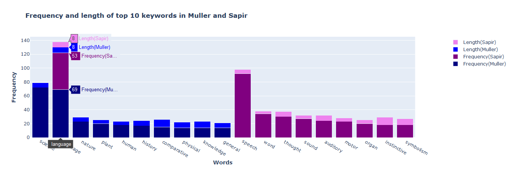
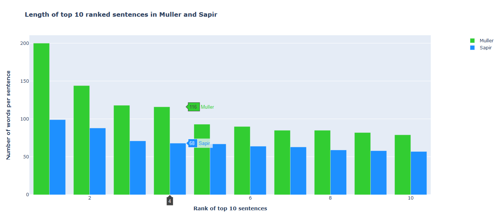
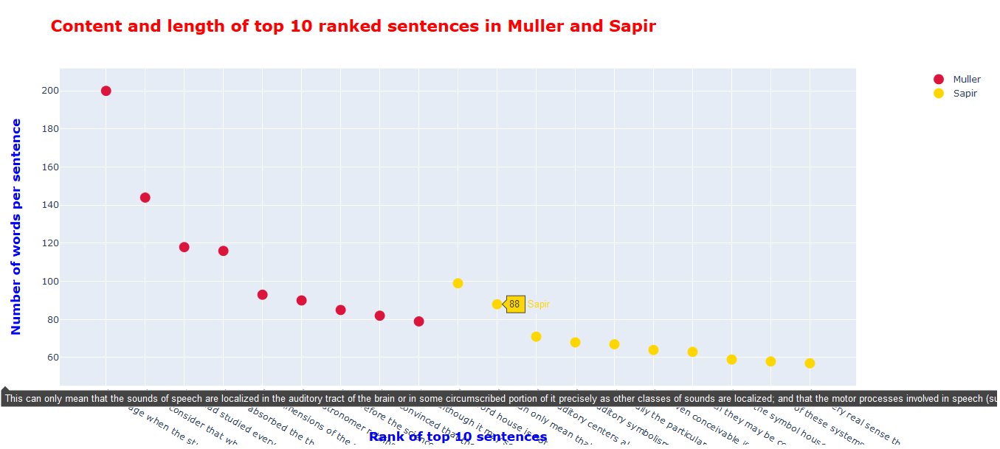

# Data Graphs with Plotly and Python

A project in Digital Humanities focused on data manipulation and visualization in Python. Specific data gets extracted from two TXT files, finding out: a) top longest sentences, their content and word count; and b) 10 most frequently used words and their length (excluding predetermined stopwords). The extracted data then gets appended to CSV files, after which it is visualized as bar charts and scatter plots, showing dependencies between two files or within the same file but between various parameters.

## Built with

- Python 3.8.5
- Pandas
- Plotly/Dash
- Flask

## Preview

